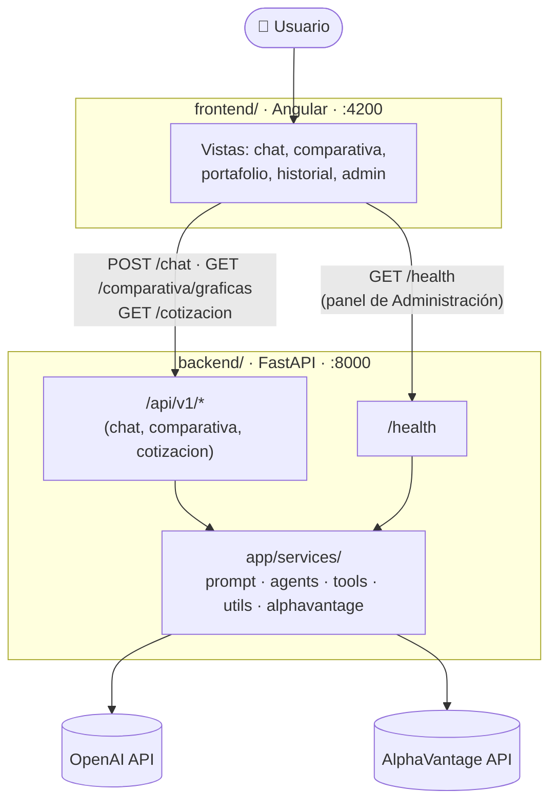
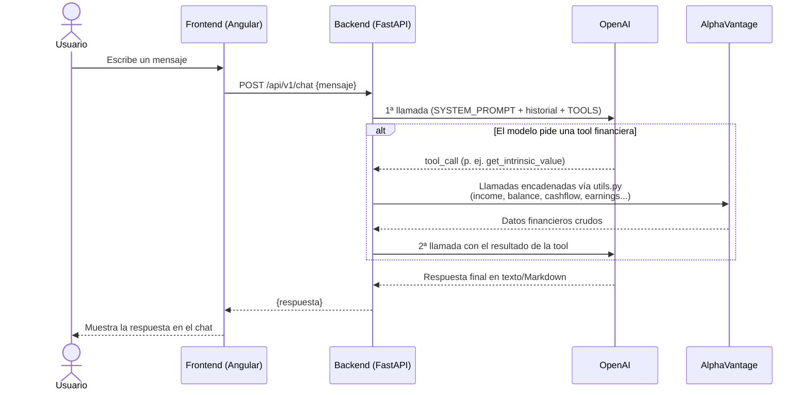
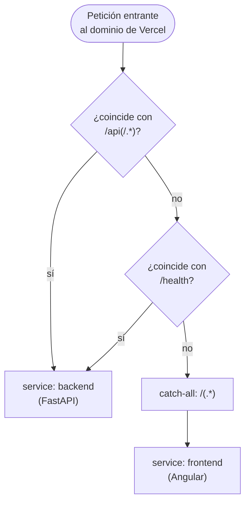

# Inver-AI

Proyecto educativo del Diplomado: un asesor financiero conversacional. El repositorio
está dividido en dos carpetas principales, pensadas para crecer de forma independiente:

```
backend/       # API en FastAPI (Python) — lógica de negocio
frontend/      # Aplicación en Angular (TypeScript) — interfaz de usuario
vercel.json    # Config de despliegue (Vercel Services — ver sección "Despliegue en Vercel")
```

La landing y el chat (antes `index.html`/`chat.html` estáticos) ahora viven como páginas
Angular en `frontend/src/app/features/`, y el saludo del asistente ya no se genera en el
navegador: el frontend llama a un endpoint real del backend (`POST /api/v1/chat`).

## Arquitectura



En producción (Vercel) ambos servicios quedan bajo el mismo dominio — ver
["Despliegue en Vercel"](#despliegue-en-vercel) para el diagrama de ruteo.

## Backend (FastAPI)

```bash
cd backend
python3 -m venv .venv
source .venv/bin/activate
pip install -r requirements.txt
uvicorn app.main:app --reload --reload-dir app --port 8000
```

`--reload-dir app` es importante: sin él, `--reload` vigila toda la carpeta `backend/`,
incluido `.venv/`. Cualquier escritura dentro del entorno virtual (instalar dependencias,
caché de bytecode) dispara un reinicio del servidor, y cada reinicio corta a mitad de camino
cualquier llamada en curso a AlphaVantage — que puede tardar minutos (ver más abajo).

- Documentación interactiva: http://localhost:8000/docs
- Salud del servicio: http://localhost:8000/health — además de `status`, expone si OpenAI y
  AlphaVantage están configurados y qué modelo está activo (nunca las claves); lo consume la
  vista de Administración del frontend (`features/admin/`) para un panel de estado rápido.
- Tests: `pytest -v` (con el entorno virtual activado)
- `GET /api/v1/comparativa/graficas?ticker=AAPL&categoria=income` — gráficas de Plotly
  (`app/services/visualization.py`) para la vista "Comparativa de compañías" del frontend.
  `categoria` ∈ `income | fcf | roic | precio`. Para poder importarse, se corrigió el import
  de nivel superior de `visualization.py` (`from utils import ...` → `from app.services.utils
  import ...`, mismo problema que ya tenía `tooling.py`) y se agregó `get_price_history()` a
  `utils.py` (faltaba; `viz_price_history` la necesitaba).
- `GET /api/v1/cotizacion?ticker=AAPL` — último precio (`GLOBAL_QUOTE` de AlphaVantage, vía
  `app/services/alphavantage.py`). La usa la vista "Mi portafolio" para autocompletar "Ticker"
  y "Precio por acción" al dar de alta una posición: el usuario solo elige la empresa (combo
  box) y las acciones.

La lógica de negocio vive en `backend/app/services/`, separada del endpoint HTTP
(`backend/app/api/v1/endpoints/chat.py`) para poder crecer sin tocar la capa de transporte.

### Asistente con OpenAI y AlphaVantage

`POST /api/v1/chat` llama a `services/prompt.py`, que orquesta al modelo de OpenAI y, si tu
agente lo pide, a AlphaVantage. El contrato HTTP no cambia (`{"mensaje"}` → `{"respuesta"}`).



**1. Configurar las claves** (solo en el backend; nunca se envían al frontend):

```bash
cd backend
cp .env.example .env      # y completa OPENAI_API_KEY y ALPHAVANTAGE_API_KEY
```

El archivo `.env` no se versiona. Sin `OPENAI_API_KEY` el asistente funciona en **modo
demostración** (responde con un saludo), así la app sigue operando mientras cargas las claves.
Reinicia `uvicorn` después de editar el `.env`.

**2. Pegar tus prompts, tools y agentes.** Cada archivo trae una zona marcada con
`# >>> PEGA AQUÍ … # <<< FIN`:

| Qué | Archivo | Qué contiene |
|---|---|---|
| Prompts | `backend/app/services/prompt.py` | `SYSTEM_PROMPT`, `PROMPTS`, `construir_mensajes()` y `generar_respuesta()` (el punto de entrada que llama el chat) |
| Function tools | `backend/app/services/tools.py` | `TOOLS` (definiciones, formato Chat Completions) y `TOOL_REGISTRY` (nombre → función). Ya trae 6 tools reales de datos financieros (estado de resultados, balance, flujo de caja, ganancias, transcripción de *earnings call* y valor intrínseco), adaptadas de `app/services/utils.py`. Agrega las tuyas con el mismo patrón |
| Agente | `backend/app/services/agents.py` | `ejecutar_agente()`: ciclo por defecto modelo → tools → modelo (tope `MAX_ITERACIONES`). Reemplázalo si usas otro esquema |
| Datos de mercado | `backend/app/services/alphavantage.py` | `consultar()` genérico + `symbol_search`, `company_overview`, `global_quote`. Independiente de `utils.py`/`tools.py`, que hacen sus propias llamadas a AlphaVantage con `requests` |

Los errores de OpenAI o AlphaVantage llegan al frontend como `502` y el chat muestra su mensaje
de error habitual. Los tests (`pytest`) no usan red ni claves reales.

### Notas operativas de las tools financieras

- **`app/services/utils.py` y `app/services/tooling.py`** son los scripts que ya traías tú.
  `tools.py` reutiliza las funciones de `utils.py` (estados financieros, valor intrínseco,
  *earnings call*), envueltas en un hilo aparte (`asyncio.to_thread`) para no bloquear el
  servidor mientras esperan a AlphaVantage/OpenAI, y con un límite de tiempo
  (`TIMEOUT_TOOL_SEGUNDOS` / `TIMEOUT_TOOL_LARGO_SEGUNDOS`, ambos en `tools.py`). `tooling.py`
  ya no se importa: su lista de tools y su `handle_tool_calls` quedaron reemplazados por
  `TOOLS`/`TOOL_REGISTRY`/`ejecutar_tool()`, que es lo que ya usaba el resto de este
  andamiaje. El archivo se deja en el repo por si quieres consultarlo.
- **AlphaVantage (plan gratuito) es lento y variable:** se midió entre ~30s y ~100s para un
  solo estado financiero con una clave real, en momentos distintos. `get_intrinsic_value`
  encadena ~10 llamadas de ese tipo. Si el asistente responde "no pude completar la consulta"
  más seguido de lo esperado, sube `TIMEOUT_TOOL_SEGUNDOS`/`TIMEOUT_TOOL_LARGO_SEGUNDOS` en
  `tools.py` (el asistente nunca inventa cifras si la herramienta falla o tarda demasiado).
- **Cada `requests.get()` de `utils.py` lleva `timeout=TIMEOUT_ALPHAVANTAGE_SEGUNDOS` (100s).**
  Sin ese timeout, una conexión colgada bloqueaba su hilo (`asyncio.to_thread`) para siempre:
  `asyncio.wait_for()` cancela la *espera* del lado de asyncio, pero no puede matar el hilo
  real, así que seguía vivo indefinidamente y nunca liberaba su cupo en el thread pool. Con un
  par de llamadas fallidas (por ejemplo, al comparar dos compañías, cada una con hasta 4
  llamadas) el pool se saturaba y hasta las peticiones nuevas se quedaban colgadas para
  siempre, aunque AlphaVantage respondiera con normalidad. Por el mismo motivo,
  `backend/app/api/v1/endpoints/comparativa.py` subió sus timeouts por categoría (antes 180s/
  300s, ahora `TIMEOUT_SEGUNDOS=420` para `income`/`fcf`/`precio` y `TIMEOUT_LARGO_SEGUNDOS=850`
  para `roic`), ya que estas categorías encadenan hasta 4-8 llamadas secuenciales y el límite
  anterior se quedaba corto incluso en condiciones normales.
- **Modelos con razonamiento (reasoning):** si tu `OPENAI_MODEL` es de este tipo, la primera
  llamada con tools puede fallar con un 400 de OpenAI (`param: reasoning_effort`). `agents.py`
  ya lo detecta y reintenta automáticamente con `reasoning_effort="none"`; no hace falta nada
  de tu parte.
- **Ver qué tool llamó el agente:** con `uvicorn` corriendo verás líneas como
  `INFO:app.services.tools: Llamando a la herramienta get_income_statement con {...}` en la
  terminal (`app/main.py` configura el logging para que se vean).

## Frontend (Angular)

```bash
cd frontend
npm install   # solo la primera vez
ng serve
```

- Aplicación: http://localhost:4200
- La URL del backend se configura en `frontend/src/environments/environment.development.ts`
  (`apiUrl: 'http://localhost:8000/api/v1'`).
- Plotly.js se carga por CDN en `src/index.html` (no por `npm`, para no sumar ~3 MB al bundle
  propio de Angular) — lo usa `shared/components/plotly-chart/` para dibujar las gráficas de
  la Comparativa de compañías; requiere conexión a internet, igual que Google Fonts.

## Correr todo en desarrollo

Se necesitan **dos terminales**, una por servicio:

1. Terminal 1: `cd backend && source .venv/bin/activate && uvicorn app.main:app --reload --reload-dir app --port 8000`
2. Terminal 2: `cd frontend && ng serve`

Con ambos corriendo, abrir http://localhost:4200, ir a "Iniciar chat" y escribir un mensaje:
la respuesta del asistente llega desde el backend (se puede confirmar en la pestaña Network
del navegador, como una petición `POST` a `http://localhost:8000/api/v1/chat`).

## Despliegue en Vercel

`vercel.json` (raíz del repo) usa la feature [Services](https://vercel.com/docs/services)
de Vercel para desplegar frontend y backend como un solo proyecto, en un solo dominio:

```json
{
    "services": {
        "frontend": { "root": "frontend", "framework": "angular" },
        "backend": { "root": "backend", "framework": "fastapi", "entrypoint": "app.main:app" }
    },
    "rewrites": [
        { "source": "/api(/.*)?", "destination": { "type": "service", "service": "backend" } },
        { "source": "/health", "destination": { "type": "service", "service": "backend" } },
        { "source": "/(.*)", "destination": { "type": "service", "service": "frontend" } }
    ]
}
```

Las `rewrites` se evalúan en orden — la primera regla que matchea decide el destino:



- `entrypoint: "app.main:app"` le dice a Vercel dónde vive la app ASGI dentro del servicio
  `backend` — mismo módulo:variable que usa `uvicorn app.main:app` en local.
- La regla `/health` es necesaria además de `/api(/.*)?`: el panel de Administración del
  frontend (`features/admin/`) llama a `/health` en la raíz, no bajo `/api/v1` (ver
  `frontend/src/app/features/admin/services/estado.ts`). Sin esa regla, caería en el catch-all
  hacia el frontend en vez de llegar al backend.
- `frontend/src/environments/environment.ts` (producción) ya usa la ruta relativa `/api/v1`,
  así que no necesita ninguna variable de entorno en build — las rewrites resuelven todo bajo
  el mismo dominio.

**En el dashboard de Vercel** (pantalla de import/configuración del proyecto):
- **Root Directory** debe quedar en `./` — es donde Vercel busca `vercel.json` con la clave
  `services`. Cambiarlo a `frontend` o `backend` hace que deje de verla.
- **Build and Output Settings** (Build/Output/Install Command) deben quedar apagados: en modo
  `services` esos ajustes se definen por servicio dentro de `vercel.json`, no a nivel de
  proyecto.
- **Environment Variables** sí hay que llenarlas ahí (no van en `vercel.json`), con las mismas
  claves de `backend/.env.example`: `OPENAI_API_KEY`, `OPENAI_MODEL`,
  `ALPHAVANTAGE_API_KEY`, `INVERAI_ALPHAVANTAGE_CACHE_TTL`, `INVERAI_ORIGENES_CORS`.

**Pendiente sin resolver:** las funciones serverless de Vercel tienen un límite de duración
muy por debajo de lo que tardan los endpoints que encadenan varias llamadas a AlphaVantage
(`/api/v1/comparativa/graficas`, la tool `get_intrinsic_value` del chat — ver timeouts arriba,
de hasta 850s). Es probable que esas vistas fallen por timeout en producción tal como está hoy;
no es algo que resuelva la config de despliegue.

## Estructura pensada para crecer

- `backend/app/api/v1/` — nuevos endpoints se agregan como nuevos módulos en `endpoints/` y se
  registran en `router.py`.
- `backend/app/services/` — lógica de negocio, independiente de HTTP (asistente, clientes de
  OpenAI y AlphaVantage).
- `frontend/src/app/features/` — cada pantalla nueva (por ejemplo, un futuro login) se agrega
  como una carpeta hermana de `landing/` y `chat/`.
- `frontend/src/app/core/` — servicios compartidos por toda la app (tema, y a futuro
  autenticación, interceptores, etc.). `services/portfolio.ts` es el ejemplo a seguir para
  estado propio de una feature que se persiste en el cliente (signal + `localStorage`, sin
  backend): lo usa `features/portafolio/` para la cartera del usuario. Para estado de **sesión**
  (ligero y efímero, no un archivo permanente) el patrón es `services/storage-efimera.ts`
  (adaptador sobre `sessionStorage`, único punto que cambiaría si un día fuera `localStorage`,
  IndexedDB o el backend) + `services/historial.ts` sobre ese adaptador — usado por
  `features/historial/` para las conversaciones con el asistente de esta sesión del navegador.
- `frontend/src/app/core/layout/` — el `Shell` (panel lateral colapsable + contenido) que envuelve
  las vistas internas. Para agregar una vista al menú: un ítem en `nav-items.ts` y su ruta en
  `app.routes.ts` (mientras no exista, la ruta usa el componente `Placeholder`).
- `frontend/src/app/shared/` — componentes y pipes reutilizables entre features. Por ejemplo,
  `components/markdown` (`<app-markdown [contenido]="...">`) muestra el Markdown que devuelve el
  asistente (con emojis, tablas y listas) y sanea el contenido: el HTML crudo no se interpreta.
